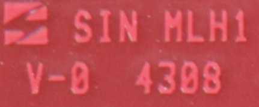
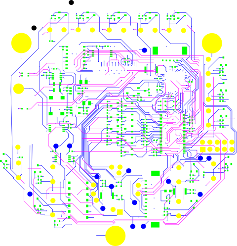

# R1MX
*Disclaimer: This repository is for educational purposes only.*
An honest attempt to reverse engineer the RED ONE camera for failure analysis
and obsolescence management.  

The RED ONE is a digital cinema camera that is known for being the first
digital camera that is equivalent to "35mm film". It was released in 2007 and
was the first production camera of [Red Digital Cinema](https://en.wikipedia.org/wiki/Red_Digital_Cinema).

In 2010, the 14 Megapixel Mysterium-X sensor was introduced as an upgrade for 
the Red One, effectively known as the RED ONE MX. 

The RED ONE and RED ONE MX camera has been discontinued since (?) and are no longer
covered by warranty, serviceable by the manufacturer, and are quickly becoming 
e-waste. 

In 2007, Manfred Lopez asked, "What Will Red One's Lifespan be?"

> We have 16mm and 35mm cameras here from the 80s that are still being used. 
> People still use Konvas that are 30 years old.
> The technology will get better, no doubt. 
> But im sure Red will last generations... resolution will maintain itself. 
> -- <cite>Jarred Land</cite>

Unfortunately, late 2008 the fate of the RED ONE was rendered obsolete with the
announcement of the next generation RED cameras.    

Today, those of us who own and operate RED ONE cameras choose to do so for
many reasons, but we do so at the risk of having no path forward when something
eventually breaks or stops working.

Very little information exists on the Internet that can assist with the debugging, 
maintenance, and repair of RED ONE and RED ONE MX cameras.

Fortunately, the technology and engineering within the RED ONE is known and 
reversible.  

This repository contains the research and progress of reverse engineering the 
RED ONE camera for the goal of producing:

1. Schematics.
2. Component lists.
3. Debugging steps.
4. Repair guides.

Research:
* https://dforte.ece.ufl.edu/wp-content/uploads/sites/65/2020/08/ISTFA_2015_PCB-RE-final.pdf
* http://www.grandideastudio.com/wp-content/uploads/pcb_deconstruction_techniques_slides.pdf

## Overview (wip)
The RED ONE MX is a digital cinema camera that uses a 14 Megapixel MYSTERIUM-X
sensor [1]. The sensor data is processed through an FPGA (Xilinx Virtex-4), 
encoded, and persisted to external media (SSD, CF, or Hard Drive). 

The camera body is primarily precision machined aluminum (grade ?) and houses 
four primary PCB boards, one sensor board, and various supporting boards:
* AUDIO_PCI Board
* CPI_IO Board
* ? Board
* POWER Board
* UI Board
* SENSOR Board
* ?
* ?

## Background
The PCB boards were manufactured by the [Sanmina Corporation](https://web.archive.org/web/20081024222256/https://www.sanmina.com/).

# Boards

## CPU_IO Board

#### Top
Connects to the AUDIO_PCI board via a 180 position high-speed mezzanine connector (part number?).

#### Bottom
Connects to the CPU_SENSOR (name?) board via a 240 position high-speed mezzanine connector (part number?).
3x connectors to the Monitor, EVF, and ?

## AUDIO_PCI Board
* ISP1562
 * Universal serial bus PCI host controller
* NET2280REV1A-LF
 * USB Bridge, USB to SPI USB 2.0 Interface
* SiI3512ECTU128
 * SATA 2-port PCI host controller
* PCA9698DGG
 * 40-bit parallel I/O port expansion for I2C-bus
* TMDS141
 * HDMI Hider
* DAC23
 * Stereo audio D/A converter, 8 to 96kHz with integrated headphone amplifier
* PGA2500I
 * Digitally controller microphone preamplifier
* GS2978
 * 3G SDI cable driver

#### Top

#### Bottom

## UI Board
Provides the physical control interface for camera operators.

* LTBPY
 * Hot swappable 2-wire bus buffer
* PCA9698DGG
 * 40-bit parallel input/output (I/O) port expansion for I2C-bus
* AD5241
 * 256-Position Digital Potentiometers
* R3032XL
 * CoolRunner XPLA3 CPLD

#### Top

#### Top

#### Layout

# Troubleshooting
## Common issues (wip)
These are common issues that have been seen with the RED ONE MX cameras.

1. Unable to detect SSD, RED Drive, or CF Modules.
* Fault with the CPU_IO and AUDIO_PCI board interconnect.

2. No SDI or HDMI output.
* Fault with the CPU_IO and AUDIO_PCI board interconnect.

3. No audio input through XLR.
* Fault with the CPU_IO and AUDIO_PCI board interconnect.

### Fault with the CPU_IO and AUDIO_PCI board interconnect.
If the video (sdi, hdmi), xlr audio, and storage (cf, ssd, hard drive) are not
working, it is possible that the interconnect (part number ?) between the CPU_IO
and AUDIO_PCI board has broken traces on the CPU_IO board.

# Firmware
## Releases
(wip)
*Contact me if you have a build that is not listed below*

* Build 13 v1.8.8
* Build 15 v2.2.5
* Build 16 v3.2.5
* Build 17 v3.4.1
* Build 20 v20.1.3
* Build 20 v20.1.6
* Build 21 v21.4.1
* Build 30 v30.7.0
* Build 31 v31.6.16
* Build 32 v32.0.3

### Resources
1. https://support.red.com/hc/en-us/articles/360011307074-RED-ONE-Specs
2. https://www.linkedin.com/in/thao-ho-b3984330
3. https://www.xilinx.com/member/forms/download/xef.html?filename=EDK91.zip
4. https://www.xilinx.com/member/10x_and_prior_regids.html

### About me
I'm the proud owner of several RED ONE MX digital cinema cameras.
Some of them work, and some don't. These cameras provide me both a utility and
a slice of history. In 2019, my primary film camera was damaged during a flight 
to Norway. 

Being a Software Engineer and hobbyist electrical engineer, I expected technical
problems. However, I did not anticipate the challenge of not being able to access
information that could help me in my repair.  

I have tremendous respect and admiration of RED Digital Cinema, their products, 
and their innovation in the film industry. 

But I want to fix my camera, and help those who are in similar situations. 

#### License
Permission is hereby granted, free of charge, to any person obtaining a copy
of this software and associated documentation files (the "Software"), to deal
in the Software without restriction, including without limitation the rights
to use, copy, modify, merge, publish, distribute, sublicense, and/or sell
copies of the Software, and to permit persons to whom the Software is
furnished to do so, subject to the following conditions:

The above copyright notice and this permission notice shall be included in all
copies or substantial portions of the Software.

THE SOFTWARE IS PROVIDED "AS IS", WITHOUT WARRANTY OF ANY KIND, EXPRESS OR
IMPLIED, INCLUDING BUT NOT LIMITED TO THE WARRANTIES OF MERCHANTABILITY,
FITNESS FOR A PARTICULAR PURPOSE AND NONINFRINGEMENT. IN NO EVENT SHALL THE
AUTHORS OR COPYRIGHT HOLDERS BE LIABLE FOR ANY CLAIM, DAMAGES OR OTHER
LIABILITY, WHETHER IN AN ACTION OF CONTRACT, TORT OR OTHERWISE, ARISING FROM,
OUT OF OR IN CONNECTION WITH THE SOFTWARE OR THE USE OR OTHER DEALINGS IN THE
SOFTWARE.

RED, ONE, and MYSTERIUM-X are trademarks of RED.COM, LLC, registered in the U.S.
and other countries.
